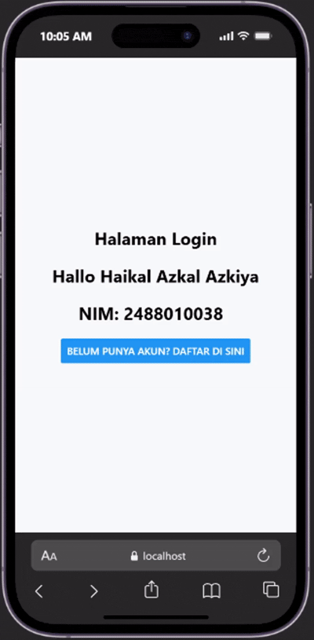
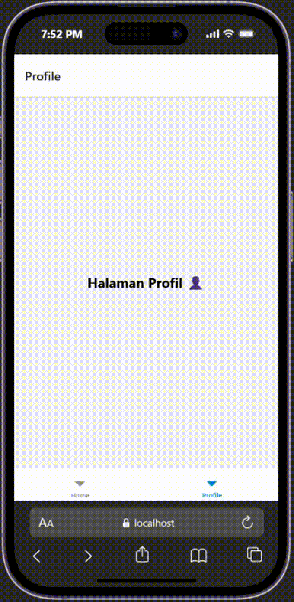
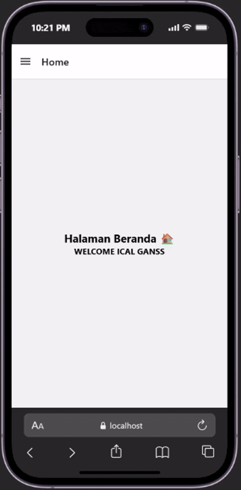

# NAVIGATION i REACT NATIVE #

### tujuan Pembelajaran ###

### Langkah Praktikum ###
#### Langkah 1: Persiapan Projek Navigasi ####
1. Mmembuat Proyek baru bernama ptmn4 (npx create-expo-app ptmn4 --template blank)
2. Change Diretory ke ptmn4 (cd ptmn4)
3. Instal core Navigation Library (npm install @react-navigation/native)
4. Instal dependensi pendukung (wajib untuk expo) (npx expo install react-native-screens react-native-safe-area-context react-native-gesture-handler react-native-reanimated)

#### Langkah 2: Membuat Stack Navigation ####
1. install library untuk navigation stack (npm install @react-navigation/native-stack)
2. Mmembuat Folder screens pada ptmn4
3. Membuat file Login.js dan Signup.js pada folder screens
4. sesuaikan isi file App.js dengan yang ada di modul
5. Instal untuk web emulator (npx expo install react-dom react-native-web)
6. npx expo start --web
7. konfirmasi bukti

#### Langkah 3: membuat Bottom Tab Navigation ####
1. Instal Libraryuntuk Bottom Tabs (npm install @react-navigation/bottom-tabs)
2. Membuat layar baru dalam folder screens (HomeScreen.js dan ProfileScreen.js)
3. sesuaikan isi file App.js dengan yang ada di modul

#### Langkah 4; membuat Drawer Navigation ####
1. Instal Libraryuntuk Bottom Tabs (npm install @react-navigation/drawer)
2. mencoba Drawer Navigation menggunakan layar Home dan Profil
3. sesuaikan isi file App.js dengan yang ada di modul
